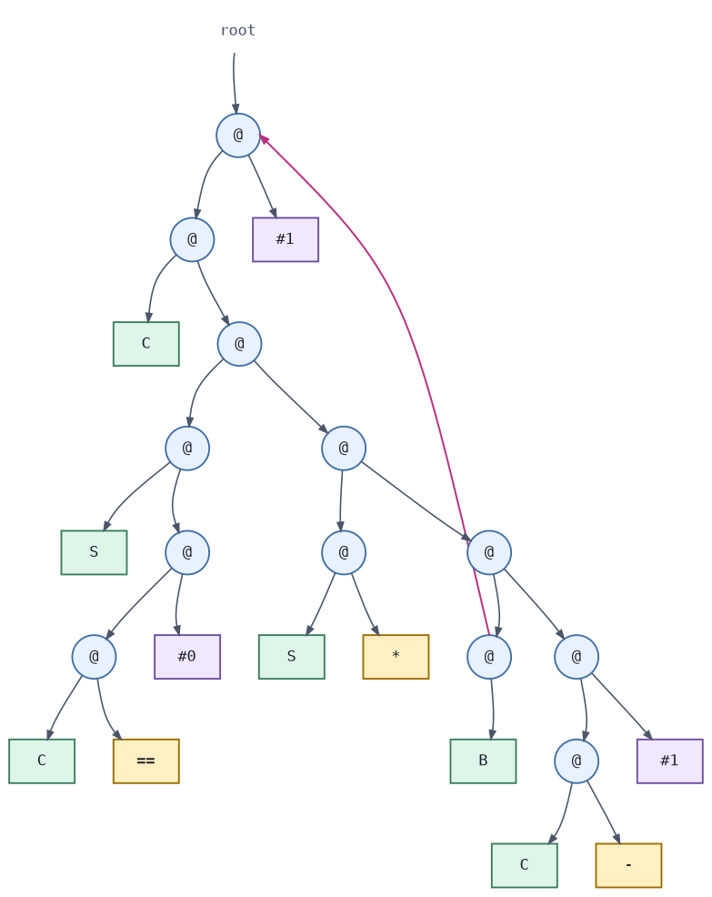

## Introduction

CloudMicroHaskell and the accompanying [paper](https://www.krook.dev/papers/cloudHaskell2026.pdf) are joint work by Lennart Augustsson and me.
Lennart presented the paper at the 2026 ACM SIGPLAN Haskell Symposium in Indianapolis.

CloudMicroHaskell reimplements Cloud Haskell on top of MicroHs.
Its defining feature is MicroHs's two compiler primitives for serializing and deserializing almost any value. Exceptions are runtime resources such as:

1. MVars
2. Threads
3. Pointers to C code

CloudMicroHaskell is not intended to replace or improve upon Cloud Haskell.
Instead, it takes Cloud Haskell's ambition, Erlang-style distributed programming in Haskell, and explores what the API could look like if the compiler provided serialization as a primitive.
The resulting API feels closer to Erlang and is significantly easier to use than Cloud Haskell's.
This convenience comes with tradeoffs: many errors that Cloud Haskell catches at compile time surface only at runtime in CloudMicroHaskell.
Values are also not forced before serialization, so they may be evaluated somewhere other than intended.
The same problem arises in parallel Haskell programming.

This post introduces the CloudMicroHaskell API through examples, followed by generic servers and supervisors.
It then explains how MicroHs implements serialization and concludes with links to the source code and related resources.

I focus on presenting CloudMicroHaskell and draw few parallells to Cloud Haskell.
The reason for this is that the underlying idea and design is so similar that very little is added by contrasting every example with Cloud Haskell.
For readers curious to learn more, we refer to [our paper](https://www.krook.dev/papers/cloudHaskell2026.pdf) and the original [Cloud Haskell](https://www.microsoft.com/en-us/research/wp-content/uploads/2016/07/remote.pdf) paper.

Some figures and examples are adapted from our paper.

## Distributed Programming with CloudMicroHaskell

CloudMicroHaskell programs consist of processes that exchange messages.
Each process runs in the `ProcessM` monad, which has a `MonadIO` instance, and the `spawn` function creates new processes.
The following example spawns a process on a remote node.
The new process waits for a `Ping` message and then replies to its parent with `Pong`:

```haskell
data PP = Ping | Pong

program :: ProcessM ()
program = do
    s <- self
    n <- node
    ns <- nodes
    let remote = head $ filter (/= n) ns -- assume length ns >= 2

    pid <- spawn remote $ do
      Ping <- expect
      send s Pong

    send pid Ping
    Pong <- expect
    liftIO $ putStrLn "received pong!"
```

Here, `self` returns the process identifier (`Pid`) of the current process.
`node` returns the identifier (`NodeId`) of the node on which the process is running, while `nodes` returns all connected nodes, including the local node.
The example removes the local node from this list and selects a remote node on which to spawn the new process.

Every process has a mailbox that receives messages from other processes.
`expect` searches the mailbox for a message of the expected type.
If no such message is present, the process blocks until one arrives.

The spawned process captures the free variable `s` directly.
The program can also send the user-defined `PP` type between nodes without defining any serialization machinery.
The runtime serializes and deserializes these values automatically.

A CloudMicroHaskell network consists of nodes identified by an IP address and a port number.
Every CloudMicroHaskell program begins by starting such a node.
`runNode` also accepts configuration flags, which this example leaves at their defaults:

```haskell
ip :: String
ip = "127.0.0.1"

port :: Int
port = 3232

main :: IO ()
main = runNode defaultFlags (mkNodeConfig (ip, port)) $ return ()
```

This program starts a node at the given address and leaves it listening for requests from other nodes.
A second node can start an initial process that connects to the first:

```haskell
ip :: String
ip = "127.0.0.1"

port :: Int
port = 3233

main :: IO ()
main = runNode defaultFlags (mkNodeConfig (ip, port)) $
  runProcessM () $ do
    connect ("127.0.0.1", 3232)
    -- rest of the process
```

`connect` blocks until the two nodes have connected.
CloudMicroHaskell forms a mesh network in which every node connects directly to every other node.
For example, if `("127.0.0.1", 3232)` is already connected to a third node at `("127.0.0.1", 3234)`, it propagates the new connection so that `("127.0.0.1", 3233)` also connects to that node.
A new node can therefore join the entire network by connecting to any existing member.

The `receive` family of functions can handle messages of several types.
The following example defines two arithmetic request types and a process that handles them:

```haskell
data Add = Add Int Int Pid
data Div = Div Int Int Pid

arithServer :: ProcessM ()
arithServer = do
    receiveWait
      [ match $ \Add x y p ->
          send p (x + y)
      , matchIf (\Div _ n _ -> n /= 0) $ \Div x y p ->
          send p (x `div` y)
      ]
    arithServer
```

`receiveWait` accepts an ordered list of matchers and searches the mailbox until a message matches one of them.
A `matchIf` matcher adds a predicate, so a message must have both the expected type and a value that satisfies the predicate.
In this example, the server accepts division requests only when the divisor is nonzero.

Each node also maintains a local registry in which processes can register names.
Other processes can then address a registered process by name instead of by its process identifier:

```haskell
data PP = Ping | Pong

program :: ProcessM ()
program = do
    s <- self
    n  <- node

    spawn n $ do
      register "child"
      Ping <- expect
      send s Pong

    send "child" Ping
    Pong <- expect
```

Erlang is associated with the slogan “Let it crash.”
Instead of requiring every process to anticipate and handle every possible error, this approach favors simple processes that other processes can monitor and restart.
Erlang, Cloud Haskell, and CloudMicroHaskell all support this pattern through process monitoring:

```haskell
process :: ProcessM ()
process = -- does something

parent :: NodeId -> ProcessM ()
parent n = do
    pid <- spawn n process
    monitor TrapExit pid
    ProcessDied _ _ <- expect
    parent n
```

Here, `parent` spawns `process` and monitors it using the `TrapExit` option.
When `process` terminates, `parent` receives a `ProcessDied` message and restarts it.
With the alternative `Succumb` option, `parent` terminates together with the monitored process.
A process can also terminate another process explicitly with `exit :: Pid -> Reason -> ProcessM ()`.

### Generic Servers

A process often acts as a server: it maintains state, receives requests, and sends responses.
Erlang captures this pattern in the `gen_server` behaviour.
CloudMicroHaskell provides a similar abstraction while using Haskell's type system to ensure that clients send well-typed requests.

The programmer defines a server through a server specification:

```haskell
data ServerSpec st callReq castReq reply = ServerSpec
    { setup      :: ProcessM st
    , handleCall :: st -> callReq -> ProcessM (st, reply)
    , handleCast :: st -> castReq -> ProcessM st
    , tearDown   :: st -> ProcessM ()
    }

startServer :: NodeId -> ServerSpec st callReq castReq reply -> ProcessM (Server callReq castReq reply)
-- run the server in the *current* process
runServer :: ServerSpec st callReq castReq reply -> ProcessM ()

call :: Server callReq castReq reply -> callReq -> ProcessM reply
cast :: Server callReq castReq reply -> castReq -> ProcessM ()
```

A `ServerSpec` defines how the server initializes and tears down its state, handles synchronous requests with `call`, and handles asynchronous requests with `cast`.
The generic server manages the receive loop, message matching, and state transitions.
Once the server is running, clients interact with it through the typed `Server` handle, which ensures that calls and casts use the request types declared by the specification.
The following example defines a counter whose integer state can be incremented, reset, or retrieved:

```haskell
data CallRequest = Get
data CastRequest = Inc | Reset

handleCounterCall :: Int -> CallRequest -> ProcessM (Int, Int)
handleCounterCall c Get = return (c, c)

handleCounterCast :: Int -> CastRequest -> ProcessM Int
handleCounterCast c Inc   = return (c + 1)
handleCounterCast c Reset = return 0

counterSpec :: ServerSpec Int CallRequest CastRequest Int
counterSpec = ServerSpec
    { setup      = return 0
    , handleCall = handleCounterCall
    , handleCast = handleCounterCast
    , tearDown   = \_ -> return ()
    }
```

We can now start and use the counter server directly:

```haskell
example :: NodeId -> ProcessM ()
example n = do
 server <- startServer n counterSpec

 cast server Inc
 cast server Reset
 cast server Inc
 cast server Inc
 i <- call server Get

 liftIO $ putStrLn $ "counter is: " ++ show i

 stopServer server
```

### Supervisors

Supervisors are another reusable component in actor-based systems.
As discussed above, processes can remain simple by letting another process restart them after failures.
A CloudMicroHaskell supervisor receives a list of child specifications, starts and monitors those children, and applies the configured restart policy when one terminates.
A child specification has the following form:

```haskell
data Restart = Permanent | Transient | Temporary

data ChildSpec = ChildSpec
    { childName    :: String
    , childStart   :: ProcessM ()
    , childNode    :: Maybe NodeId
    , childRestart :: Restart
    }
```

Each child has a name and a restart policy.
The `childStart` field defines the process to spawn, while `childNode` can pin that process to a particular node, perhaps one that hosts a required resource such as a database.
If `childNode` is `Nothing`, the supervisor selects a node.
See the [Erlang supervisor documentation](https://www.erlang.org/doc/apps/stdlib/supervisor.html) for details of the restart policies.
We can turn the counter server defined above into a `ChildSpec` as follows:

```haskell
let child = ChildSpec
      { childName    = "counter"
      , childStart   = runServer counterSpec
      , childNode    = Nothing
      , childRestart = Permanent
      }
```

A `SupervisorSpec` combines one or more child specifications with a supervision strategy and restart limits:

```haskell
data Strategy = OneForOne | OneForAll

data SupervisorSpec = SupervisorSpec
    { strategy  :: Strategy
    , intensity :: Int
    , period    :: Int
    , children  :: [ChildSpec]
    }
```

The strategy determines whether the supervisor restarts only the child that terminated (`OneForOne`) or every supervised child (`OneForAll`).
The `intensity` and `period` fields limit how often children may restart: the supervisor permits at most `intensity` restarts within `period` milliseconds.
If the children exceed this limit, the supervisor terminates them all and reports the failure.
The following specification supervises the counter server and permits three restarts within five seconds:

```haskell
let supervisor    = SupervisorSpec
      { strategy  = OneForOne
      , intensity = 3
      , period    = 5000
      , children  = [child]
      }

```

The `supervise` function starts the supervisor and returns its process identifier:

```haskell
supervise :: SupervisorSpec -> ProcessM Pid
```

Once the supervisor is running, `getChild` retrieves a child by the name given in its `ChildSpec`.

```haskell
getChild  :: Pid −> String -> ProcessM (Maybe Pid)
```

Clients should not retain a supervised child's process identifier indefinitely.
When the supervisor restarts a child, the new process receives a new identifier and the old one becomes invalid.
A client should therefore retrieve the current identifier from the supervisor before communicating with the child.
Alternatively, the child can register itself under a name, allowing other processes to address it by that name.
Registered names are node-local, however, which requires the processes to be hosted on the same node.

The complete example starts the supervisor, retrieves the counter server that it started, and uses that server as before:

```haskell
sup <- supervise supervisor
Just pid <- getChild sup "counter"
let server = serverFromPid pid

cast server Inc
cast server Reset
cast server Inc
cast server Inc
i <- call server Get

liftIO $ putStrLn $ "counter is: " ++ show i

stopSupervisor sup
```

Together, generic servers and supervisors let us compose typed, fault-tolerant processes with little additional machinery.

We use these abstractions in [MicroSync](https://github.com/Rewbert/MicroSync), a small file-synchronisation application developed as a case study for the paper.
MicroSync combines generic servers and supervisors across several concurrent processes, demonstrating that the abstractions presented here can support a complete distributed application.
The implementation assumes an idealised setting and is intended as a case study rather than a production-ready file synchroniser.

## Running CloudMicroHaskell on Microcontrollers

For another example developed for the CloudMicroHaskell paper, we built a network containing two STM32H563ZI microcontrollers running Zephyr and an ordinary laptop.

One microcontroller runs a generic server that controls its LEDs.
The other sends messages to that server when its buttons are pressed.
The laptop joins the same network and can control the LEDs using keyboard commands.
All three use the ordinary CloudMicroHaskell API, even though the laptop runs a 64-bit runtime and the microcontrollers run 32-bit runtimes compiled as different binaries.

This example illustrates why MicroHs is an interesting foundation for distributed Haskell.
The compiled program requires roughly 300 KiB of flash, making it small enough to run on these microcontrollers.
The [STM32H5 example repository](https://github.com/Rewbert/stm32h5-mch-demo) contains the source code and build instructions.

## Serialisation & Deserialisation

CloudMicroHaskell must serialise values before it can send them between nodes.
MicroHs makes this possible because it represents running programs as graphs of primitive combinators.
The runtime can serialise these graphs directly, even when they contain unevaluated expressions or functions.
MicroHs compiles each program into a combinator expression, which its runtime evaluates using Turner-style combinator reduction.
Classical combinator calculus is often introduced through the three combinators `S`, `K`, and `I`, with the following reduction rules:

```
I x     = x
K x y   = x
S f g x = f x (g x)
```

MicroHs extends this small calculus with roughly 80 primitive combinators.
The compiler expresses every Haskell definition in terms of these primitives.
Consider the factorial function:

```haskell
fac :: Int -> Int
fac 0 = 1
fac n = n * fac (n - 1)
```

In a simplified postfix notation, MicroHs compiles this function to the following expression.
The details of the notation are not important here, but the reference to _1 and its definition as :1 encode the recursion:

```haskell
C S C == @ #0 @@ S * @ B _1 @ C - @ #1 @@@@@#1 @ :1
```

This expression is simplified because the actual compiler output also refers to dictionaries for the `Num` and `Eq` operations.
Those details do not affect the serialisation mechanism.
The original `fac` function is recursive.
In the combinator expression, the reference to `_1` and its definition as `:1` represent that recursion.
The runtime reads the expression and constructs an in-memory graph of uniformly sized nodes:



Constructing this graph from its textual representation is deserialisation.
Serialisation proceeds in the other direction, converting an in-memory graph into a transferable representation.
MicroHs serialises a graph in two passes.
The first pass identifies shared nodes and cycles, while the second produces the serialised representation.
Because the serialiser preserves the current graph, it can also preserve unevaluated expressions such as thunks.
MicroHs exposes these operations through `System.IO.Serialize`:

```haskell
hSerialize   :: forall a . Handle -> a -> IO ()
hDeserialize :: forall a . Handle -> IO a
```


A runtime graph can represent many kinds of values, including functions.
Haskell's static type system checks these values at compile time, but MicroHs does not retain their complete source-level types in the resulting graph.
Each value nevertheless has a concrete runtime representation constrained by its type.
That representation is not proof of the type, since different Haskell types may have identical runtime representations.

This distinction becomes especially important for functions.
Ordinary Haskell provides no general way to inspect a function or the values captured by its closure.
As the Cloud Haskell paper observes, a function's type describes its argument and result but says nothing about its free variables.
We therefore cannot define a conventional `Serializable` instance that works for every value of a function type.

MicroHs sidesteps this limitation by reaching into the runtime and serialising the runtime graph itself.
A function's closure and its captured values form part of that graph and can therefore be serialised with it.
Serialisation still fails if the graph contains a node that the runtime cannot serialise.
The basic deserialisation interface is also unsafe: the caller of `hDeserialize` chooses the result type `a`, but the serialised graph contains no evidence that this choice is correct.
The runtime reconstructs the graph and treats it as a value of the requested type without verifying that assumption.

MicroHs also provides a safer interface that stores an explicit type descriptor alongside the graph.
The descriptor retains at runtime some of the type information normally available only during compilation.
During deserialisation, the runtime compares the stored descriptor with the expected type and rejects a mismatch:

```haskell
hSerializeDescr   :: forall a . Data a => Handle -> a -> IO ()
hDeserializeDescr :: forall a . Data a => Handle -> IO (Maybe a)
```
MicroHs can serialise runtime graphs because its runtime interprets programs as graphs of primitive combinators.
These graphs contain no native instructions tied to a particular processor architecture, so they can be transferred between machines.

Compiler-supported serialisation is not a new design alternative.
The original Cloud Haskell paper explicitly considers an approach it calls “baking in” serialisability, in which the runtime system can serialise any value, including function closures.
The authors ultimately reject this approach because a single built-in representation gives programmers less control over serialisation, some runtime-owned values must not be serialised, and making serialisation invisible can obscure its cost. CloudMicroHaskell nevertheless explores this approach.

GHC takes a different approach.
After optimisation, it compiles definitions to native code, and its runtime closures may refer to that compiled code.
Serialising the heap graph of such a closure would therefore not produce a portable computation.
There are two relevant consequences from this: runtime closures are not portable between architectures, but programs execute much faster.
In my informal experiments, compiled GHC programs have been roughly two orders of magnitude faster than MicroHs, while MicroHs is somewhat on par with GHCi.

Cloud Haskell works within this constraint by representing remote computations as explicit closures that refer to code already available on the receiving node.
CloudMicroHaskell starts from a different premise: MicroHs can serialise the graph reachable from a computation, including both its code and captured values.
This capability enables the direct-style API shown throughout this post, but shifts some errors from compile time to runtime.

## Conclusion

CloudMicroHaskell's main result is not simply that Cloud Haskell can run on MicroHs.
Runtime graph serialisation changes how it feels to write distributed programs in Haskell.
A remote process can be expressed as an ordinary `ProcessM` action, capture variables from its surrounding scope, and exchange user-defined values without handwritten serialisation or static-closure machinery.

This directness makes CloudMicroHaskell substantially more ergonomic than Cloud Haskell.
Spawning processes, sending messages, registering names, monitoring failures, and building generic servers and supervisors combine into a programming model that feels remarkably close to Erlang.

That convenience comes with costs.
Some errors that Cloud Haskell catches at compile time instead surface at runtime, unevaluated expressions may be evaluated on a different node, and MicroHs executes programs considerably more slowly than GHC.
Nevertheless, CloudMicroHaskell demonstrates a compelling design point: with runtime support for serialising code and data together, distributed programming in Haskell can be both direct and distinctly Erlang-like.

## Resources

### Paper

The paper, _CloudMicroHaskell: Direct-Style Distributed Haskell via Runtime Graph Serialisation_, is available from the [ACM Digital Library](https://dl.acm.org/doi/10.1145/3830439.3831272).
You can also [download the paper as a PDF](https://www.krook.dev/papers/cloudHaskell2026.pdf).

### Presentations

Lennart Augustsson presented the paper at the 2026 Haskell Symposium in Indianapolis.
[Watch the recorded presentation](https://www.youtube.com/live/1z9EB7PUKJc?si=9kIZLzFLVg4rJzAd&t=19299).

Robert Krook also presented the paper at Chalmers University of Technology on 10 September 2026.
This presentation was not recorded.

#### CloudMicroHaskell

The [CloudMicroHaskell source code](https://github.com/Rewbert/CloudMicroHaskell) is available on GitHub.
CloudMicroHaskell is not currently available from Hackage, so it must be installed from source using MicroCabal, which is distributed with MicroHs:

```bash
git clone https://github.com/Rewbert/CloudMicroHaskell.git
cd CloudMicroHaskell
mcabal -r install
```

After installation, add `CloudMicroHaskell` to the `build-depends` field of your Cabal file and build the project with:

```bash
mcabal -r build
```

CloudMicroHaskell is a research prototype rather than a production-ready framework.
Contributions are welcome.
If you build something with CloudMicroHaskell, I would be very interested to hear about it.

#### network-light

CloudMicroHaskell uses [`network-light`](https://hackage.haskell.org/package/network-light), a networking package that supports both GHC and MicroHs.
I developed this package because MicroHs cannot yet compile the standard [`network`](https://hackage.haskell.org/package/network) package.
CloudMicroHaskell has modest networking requirements, so implementing a small library required less work than adding support for `network` to MicroHs.
If MicroHs gains that support, CloudMicroHaskell can replace this dependency with `network`.

#### STM32H5 demo

The [STM32H5 demonstration](https://github.com/Rewbert/stm32h5-mch-demo) contains the code needed to build and run MicroHs on an STM32H563ZI microcontroller.
MicroHs can run without an operating system, but this demonstration uses Zephyr OS to access its socket interface.

#### Paper examples

The examples from the CloudMicroHaskell paper are available as [runnable programs](https://github.com/Rewbert/cloudmicrohaskell-paper/tree/main/paper-examples).
