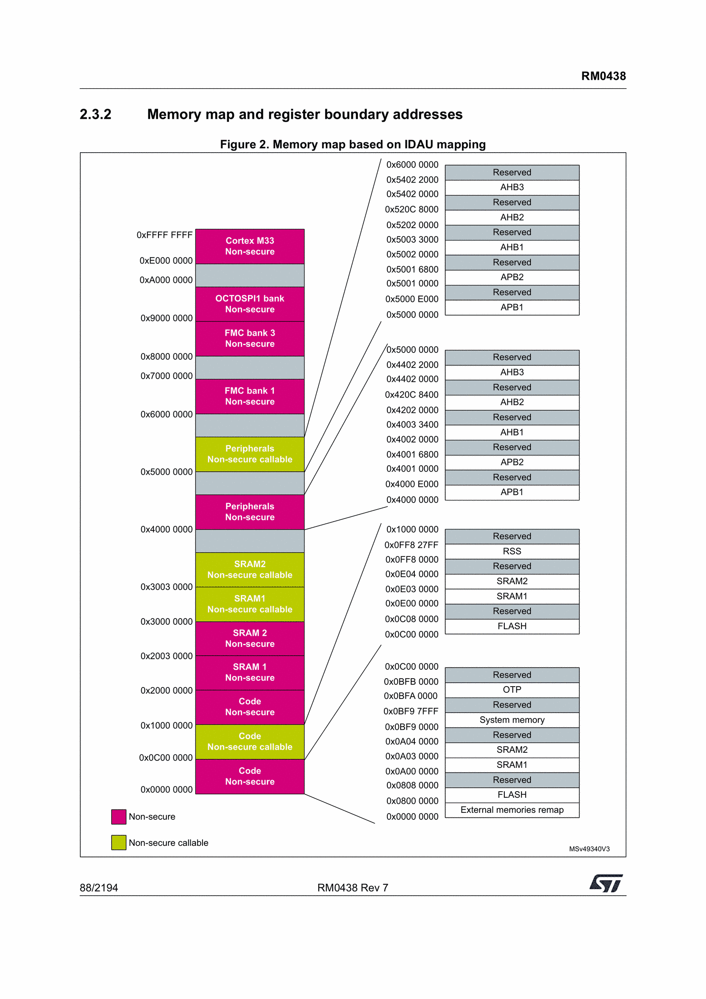
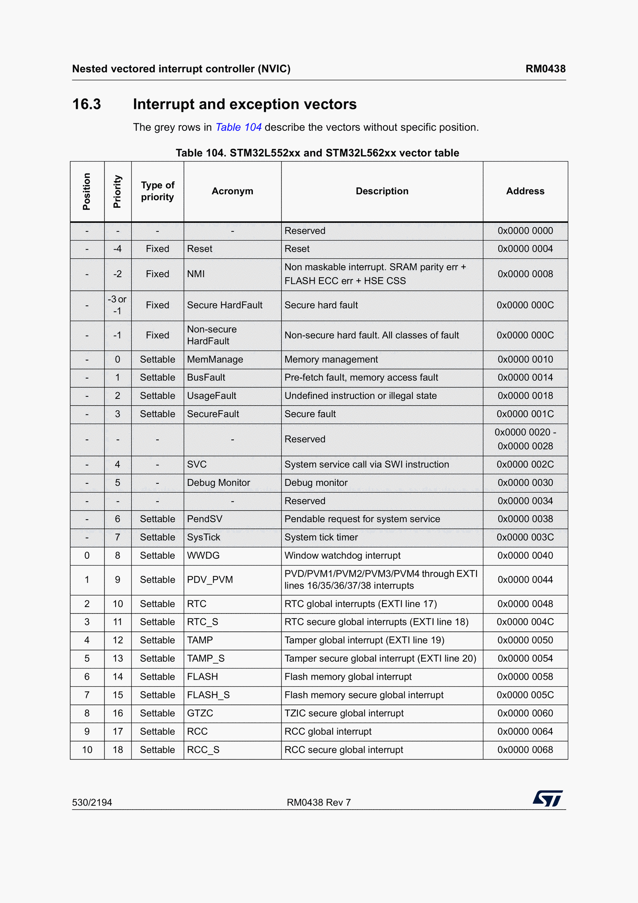
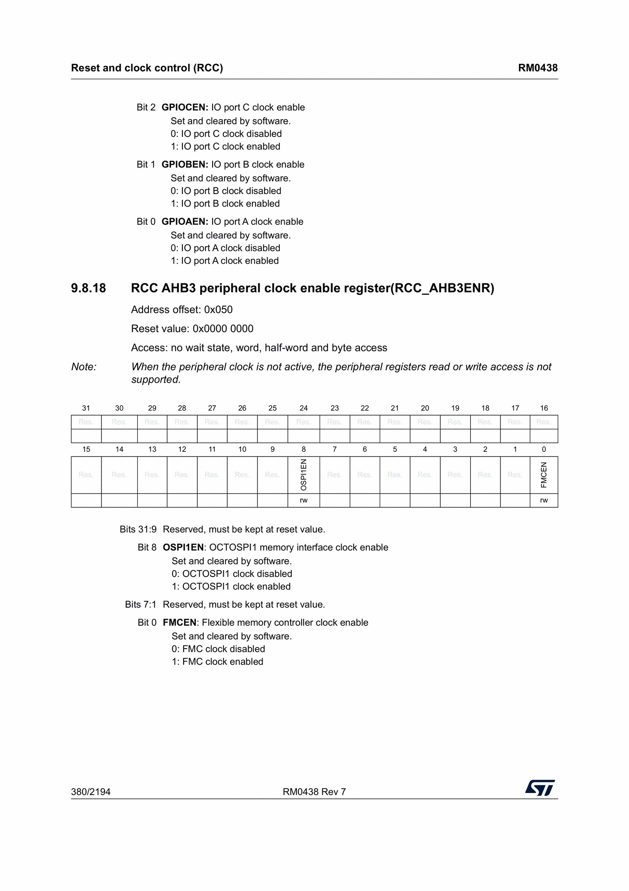
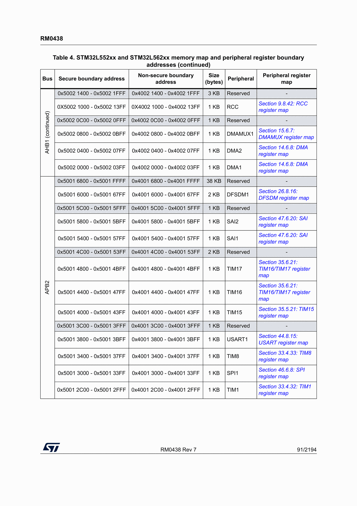
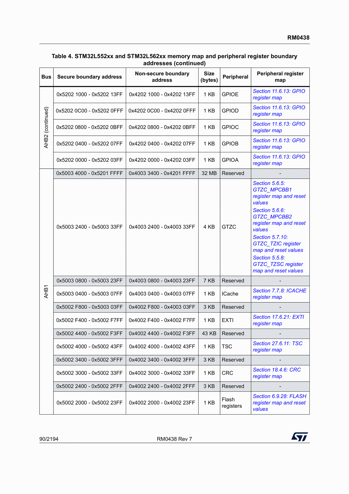
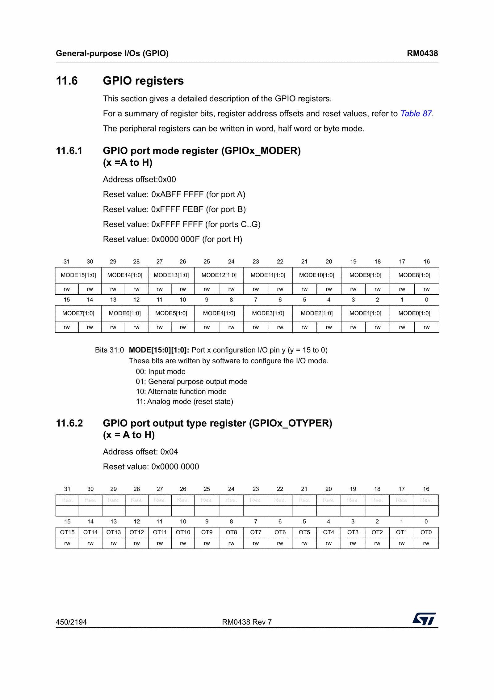
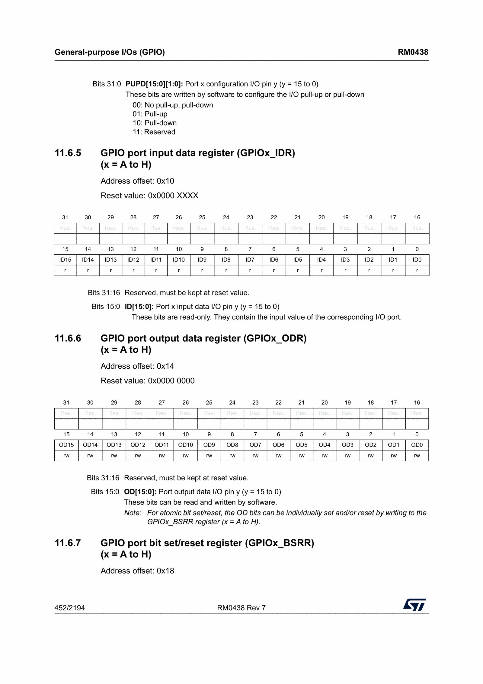
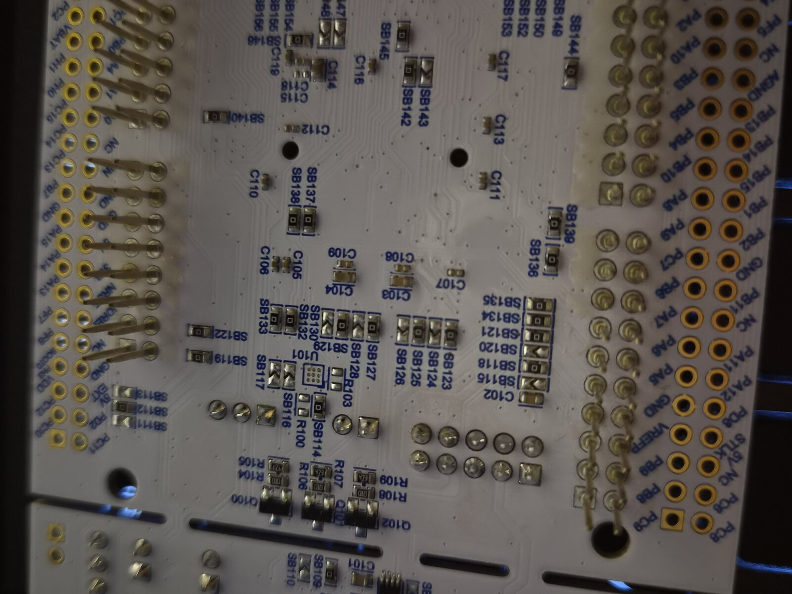
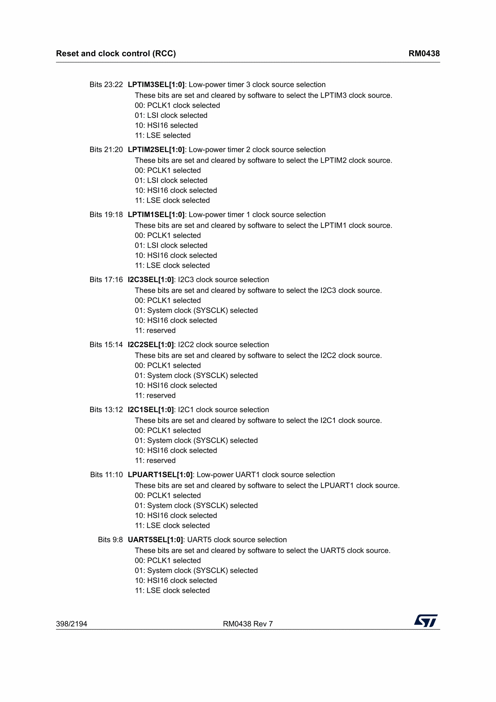

## Introduction

I intend to write a series of blog posts about my experience learning some bare metal embedded programming. I will try to keep it as a kind of "The blog series I wish I had when I started out".

My academic background is in computer science. I never had an interest in computers or programming growing up, and only started learning about it when I started my bachelors in computer science in 2014. Clearly my interest was quickly captured, as I am still studying computer science today, defending my PhD thesis in November.
My main area of focus and expertise has been functional programming, primarily using Haskell. When I started my PhD, the project I was hired for sought to develop tools and frameworks for developing secure applications for IoT devices, using functional programming. While the functional programming bit was where my expertise lay, the embedded space was new to me. Many of my projects throughout the last six years have involved MCUs or other low level platforms in some sense. Despite this, I knew very little about MCUs and embedded programming. Real-Time operating systems like Zephyr or ChibiOS offer a high-level enough framework that you can get by quite well without having to know too much of the low-level things.

Reflecting upon this after so many years, I found it a shame that I still knew quite little about the low-level things, which prompted me to engage in some bare metal programming. It has now been about a year of me tinkering with this whenever I get tired of my other projects. When I say bare metal programming, what I mean is that there is no operating system on the board. The only code that's running is code that I've written, and there is no scheduler or threads. I don't want to use an IDE or special development environment, and only want to write direct C code, linker scripts, and Makefile's.

It has been a lot of fun and oftentimes frustrating. Debugging is not always easy, and diving into a huge reference manual whenever something new is to be programmed is daunting. My hope is to write these blog posts as a kind of guide, "what I wish I had when I started programming my board". The blog posts would have saved me numerous hours of debugging.

The initial seed that helped me get started with this was a series of [blog posts by Kristian Klein-Wengel](https://kleinembedded.com/stm32-without-cubeide-part-1-the-bare-necessities/), detailing how to develop firmware for a specific STM32 board without STMCubeIde. The first post in this series might repeat most, if not all, of what Kristian says in his series. Some of the details have been swapped out for details concerning my board. The later posts in this series will introduce primarily new content, building upon the knowledge base started by Kristian.

Throughout these posts we will

- Do the basic stuff such as configuring `systick`, blinking LEDs, using UART, etc.
- Configure the PLL to increase the clock frequency of our board(s)
- Turn our code into a proper collection of drivers, with implementations for three of our boards
- Add a board abstraction layer, so that the same application code can run on any of the boards
- Add a persistent segment of memory to the linker script, and store a key-value database in it
- Run Haskell directly on the MCU (because it is fun)
- Program Arm TrustZone-M bare metal (this is a nightmare)
- Implement a framework to engage in confidential computing using Haskell and TrustZone-M

For now, let us get started with some of the easy stuff. This first post will set the scene by implementing a linker and startup script, blink some LEDs, add a `systick` handler, and configure the UART.

## What you will need to replicate what I have done

### The Board

I will begin this blog series by describing just one board, but I have programmed three boards in the same family (Nucleo), and will describe the notable differences when they become relevant. This first post will concern just one board, the [STM32L552ZEQ](https://www.st.com/en/microcontrollers-microprocessors/stm32l552ze.html) board. It has an Arm Cortex-M33 CPU, which we can push up to 110 MHz (we will do this in a subsequent post). There is 512 KB of FLASH memory, and 256 KB of SRAM. It has three LEDs and one user button.
The SRAM is divided into two actual SRAMs, SRAM1 and SRAM2. SRAM1 is 192 KB large, whereas SRAM2 is 64 KB large.

### The Toolchain

To build software for this device we are going to use the `arm-none-eabi` toolchain, containing suitable versions of most tools we might need, such as GCC, GDB, Objdump, etc. You can [download the Arm GNU toolchain here](https://developer.arm.com/downloads/-/arm-gnu-toolchain-downloads).

### The Programmer

To _flash_ our compiled program onto the board we use what is called a programmer. We will use OpenOCD. In this series of blog posts we will eventually write drivers for a second board, and support for this board has not yet made its way into OpenOCD. For this reason, ST has their own fork of OpenOCD which _does_ have support. We will clone and build [ST&#39;s fork](https://github.com/STMicroelectronics/OpenOCD)

- `git clone git@github.com:STMicroelectronics/OpenOCD.git`
- `cd OpenOCD`
- `./bootstrap`
- `./configure`
- `make` or `make -j4`, `-j8`, or however many workers you want to use

Now, the binary for OpenOCD can be found in `src` (unless you install it somewhere else).

### Documents

We will frequently refer to the [STM32L552ZEQ reference manual](https://github.com/Rewbert/bare-metal-stm32-nucleo/blob/main/manuals/reference_manual_stm32l5.pdf) to figure out how to do things.
Additionally, there is a [STM32L5 Nucleo-144 user manual describing how the specific device is configured](https://github.com/Rewbert/bare-metal-stm32-nucleo/blob/main/manuals/user_manual_stm32l5.pdf).

## Our First Program

The bare minimum that we'll need to blink one of the LEDs is

- A linker script
- A startup script
- Our program

Our linker script will tell the linker where in memory it is supposed to place the code and data, as well as where the SRAM can be found. The board has 32 bit addresses, giving us 4 billion unique addresses. However, since we _only_ have 512 KB of FLASH and 256 KB of SRAM, we use the linker script to say exactly which of these 4 billion addresses should be used.

To figure out where we are supposed to place things, we can look at the memory map.



There is a lot of things going on here, but there are just a few things that we need to learn from this table, where to place the FLASH and where to place the SRAM. I have learned that ST seem to use the same segments of addresses with most MCUs, so if you have worked on several ST MCUs before you might not need to refer to the memory map at all.

We conclude that FLASH starts at `0x08000000`, and that SRAM1 starts at `0x20000000`. We also note that SRAM2 starts immediately where SRAM1 ends, so we could in this case treat SRAM1 as if it was 256 KB large.

### Linker Script

We begin writing our linker script by declaring these regions

```ld
MEMORY
{
    ISR       (rw):  ORIGIN = 0x08000000, LENGTH = 2K
    FLASH     (rx):  ORIGIN = 0x08000800, LENGTH = 510K
    SRAM1     (rwx): ORIGIN = 0x20000000, LENGTH = 256K
}
```

We continue by declaring a variable `_estack`, which will be available to our startup script. The stack grows 'downwards' in memory, so our stack will begin at the end of SRAM. The linker script has some functions to help us compute where the stack starts.

```ld
PROVIDE(_estack = ORIGIN(SRAM1) + LENGTH (SRAM1));
```

Finally, we must define the memory sections that our program will use. The sections are `.isr_vector`, `.text`, `.rodata`, `.data`, and `.bss`. A section is declared by naming it, saying what should go into it, and where it should be located (FLASH or SRAM). As we declare definitions in this file, there is a _current address_ variable that keeps changing, called `.` (a singular dot). We sometimes refer to this special variable to create other named variables, such as `_sbss`.

```ld
SECTIONS
{
    .isr_vector :
    {
        KEEP(*(.isr_vector)) /* The code does not refer to isr_vector, so we must ask to keep it */
    } > ISR

    .text :
    {
        . = ALIGN(4);
        *(.text)
        *(.text.*)

        __exidx_start = .;
        KEEP(*(.ARM.exidx*))
        __exidx_end = .;

        . = ALIGN(4);
        _etext = .;
    } > FLASH

    .rodata :
    {
        . = ALIGN(4);
        *(.rodata)
        *(.rodata.*)
        . = ALIGN(4);

    } > FLASH

    .data :
    {
        . = ALIGN(4);
        _sdata = .;
        *(.data)
        *(.data.*)
        . = ALIGN(4);
        _edata = .;
    } > SRAM1 AT> FLASH

    _sidata = LOADADDR(.data);

    .bss :
    {
        . = ALIGN(4);
        _sbss = .;
        __bss_start__ = _sbss;
        *(.bss)
        *(.bss.*)
        *(COMMON)
        . = ALIGN(4);
        _ebss = .;
        __bss_end__ = _ebss;
    } > SRAM1

    . = ALIGN(8);
    _end = .;
    PROVIDE(end = .);
}
```

It looks a bit daunting, but it is quite straight forward once you start unraveling it. I should mention that in the `.data` section, initialised variables are placed during compilation. These must be copied from the FLASH to the SRAM during boot. We use the `> SRAM1 AT> FLASH` syntax to reserve memory in both of these sections. Declared variables are exported and visible to the program at runtime.

This linker script will carry us for a majority of this project, so I will perhaps leave it at this. For the reader that is interested in more details of how this works, I think a few google searches or a 10 minute conversation with an LLM of your choice is enough to get a grasp of it.

### ISR Vector

ISR, interrupt service routine. These are special functions that are invoked by the MCU when certain events happen. For the MCU to know how to find these functions at runtime, they are always located at the same place, the ISR vector. By ST convention this is the first thing that appears in the FLASH, at `0x08000000`. We refer back to the linker script and note that we reserved 2 KB for the ISR, and that that section started at the start of FLASH.

The shape of the ISR can be learned from the reference manual. It is quite long, as we can install many more ISRs than we need for this blog series, so for now we only focus on the first few entries.



We won't implement all of these ISRs and will only focus on the first two entries now. The first entry holds the address of the initial stack pointer, and every other entry in this vector table is a function pointer. We begin implementing our startup script by defining some constants and allocating space for the vector table

```c
#define VECTOR_SIZE_WORDS 116

extern uint32_t _estack; // This symbol is supplied by the linker script, remember?

void reset_handler(void);

uint32_t isr_vector[VECTOR_SIZE_WORDS] __attribute__((section(".isr_vector"))) = {
    (uint32_t) &_estack,
    (uint32_t)&reset_handler,
    // add more handlers as wanted
};

void reset_handler(void) {

}
```

We are using an attribute to explicitly say that the `isr_vector` should be allocated in the `.isr_vector` section of FLASH, and that the first entry is the linker symbol `_estack`. The second entry is a function pointer, pointing to the reset handler. The reset handler is the first thing that the CPU starts executing when the MCU has been turned on (or reset). The purpose of the reset handler is to

1. copy data from the `.data` section of FLASH to the `.data` section of SRAM
2. zero-initialise the `.bss` segment
3. invoke the `main` function

The first two tasks are implemented by grabbing onto the linker symbols that the linker script exposed, identifying the boundaries of the different memory sections. The complete reset handler is

```c
extern uint32_t _sdata, _sidata, _edata, _sbss, _ebss; // symbols defined by the linker

void main(void);

void reset_handler(void) {
    // Copy .data from FLASH to SRAM
    uint32_t data_size  = (uint32_t)&_edata - (uint32_t)&_sdata;
    uint8_t *flash_data = (uint8_t*) &_sidata; //etext;
    uint8_t *sram_data  = (uint8_t*) &_sdata;
  
    for (uint32_t i = 0; i < data_size; i++) {
      sram_data[i] = flash_data[i];
    }

    // Zero-fill .bss section in SRAM
    uint32_t bss_size = (uint32_t)&_ebss - (uint32_t)&_sbss;
    uint8_t *bss      = (uint8_t*) &_sbss;

    for (uint32_t i = 0; i < bss_size; i++) {
      bss[i] = 0;
    }

    main();
}
```

This is really everything necessary to fire up the board and invoke `main`. The `reset_handler` runs first, and then it calls `main`. What we need to do now is to implement `main`.

### The Program

The program we ultimately want to run will blink one of the LEDs at a fixed frequency, and output something to the UART. We will, however, begin by turning on the LED. To do this, we need to do some configurations. First of all, the red LED is bound to GPIO port A, pin 9. I'll refer to such GPIO pins by their port and name going forwards, so the red LED is on A9. Directly after reset, the GPIO ports are all unclocked, meaning that there is no current going to them. We can learn this from looking at the relevant register in the _Reset and Clock-Control_ peripheral.


We can see that bit zero of the `AHB2ENR` register in the `RCC` peripheral, after reset, is set to `0`, indicating that it is unclocked. Scrolling down a bit, we see



We simply need to write a one to this position. Sounds simple? It is, but what can be a bit hairy is to figure out exactly how to get there.

We dig through the memory map in the reference manual and learn that the RCC peripheral is controlled via addresses `0x40021000` through `0x400213FF`.



Looking at the description of the `AHB2ENR` register above, we see that it says 'offset `0x04C`'. This is the offset from the start address of the RCC address range where we will find the `AHB2ENR` register. `0x40021000 + 0x04C = 0x4002104C`. We model these as constants in our C program

```c
#define RCC 0x40021000U
#define AHB2ENR (RCC + 0x04CU)
#define GPIOA_POS 0
```

enabling the GPIO A port is now as 'simple' as writing a one to the correct position in this register. After we've done so, we need to let some cycles pass for the port to be properly clocked before we continue, or the rest of our configurations on that port might not succeed. We do this by reading back the value we just wrote. We mark the `dummy` variable as `volatile` to ensure that the compiler doesn't optimise away any reads we do to it.

```c
void enable_gpioa(void) {
    volatile uint32_t dummy;
    volatile uint32_t *ahb2enr = (uint32_t *)AHB2ENR;

    *ahb2enr |= (1U << GPIOA_POS);
    dummy = *ahb2enr;
}
```

After invoking this function, the GPIO port A will be clocked and ready. Before we can turn on the LED, however, we need to configure the specific pin. GPIO pins on these boards have several configuration options, but the one we need to change for our purposes is the _mode_ of the pin (we want to set it to _output_). Again, we look in the reference manual to figure out where we find the GPIOA peripheral



The peripheral is controlled via addresses `0x42020000` through `0x420203FF`. The specific register we need to modify is the mode one, called `MODER`. We find it in the reference manuals register map for the GPIO.



This register is at offset `0x00`. We see that there are two bits used to control each pin, with valid assignments of either `00`, `01`, `10`, or `11`. We control pin 9 with bits 18 and 19. After reset, `MODE9` has the value `11`, whereas we want to set it to `01`. We define our macros and proceed with first resetting the contents of the register (setting both bits to 0), and then writing our configuration to it.

```c
#define GPIOA 0x42020000U
#define MODER (GPIOA + 0x00U)

void configure_gpioa(void) {
    volatile uint32_t *moder = (uint32_t *)MODER;

    *moder &= ~(0x3U << 18); // set the two specific bits to 0
    *moder |= (0x1U << 18);   // write our configuration to them
}
```

Now we have written code to enable to clock for the GPIO port A, and we have configured the pin to act as an output. It is important to refer to the reference manual, as sometimes there might be more configurations needed. For instance, pins also have _pull-up pull-down_ registers and _alternate function_ registers that affect its operation, and by accident the A9 pin that we are using had the correct reset values for them. This might not always be the case, in which case you would have needed to configure those registers as well.

When it comes to turning the LED on, we refer to our reference manual and find the _output data register_.



It is at offset `0x14`, and there is one bit for each of the pins. Bit number 9 controls the 9th pin. The reset value of the LED is `0`. By writing a `1` to its register we will turn it on. We will write a function that _flips_ whatever value the LED currently has.

```c
#define ODR (GPIOA + 0x14U)

void toggle_led(void) {
    volatile uint32_t *odr = (uint32_t *)ODR;

    *odr ^= (0x1U << 9);
}
```

Now we can write our `main` function and put everything together.

```c
void main(void) {
    enable_gpioa();
    configure_gpioa();
    toggle_led();
    while(1) {}
}
```

This is the program that we will build and flash onto our board. When we press the reset button, the red LED should light up, indicating that everything went as expected.

## Building and Flashing the Board

We will build our program in two steps. First, we will build the C sources into object files, after which we will link them to produce the final binary that we will flash onto your board. This is typically done by defining build rules in a Makefile. Rules may have dependencies, and if those dependencies are built by other rules, make will ensure that they are rebuilt if they have changed since we last built them.
I won't explain everything in the Makefile, but will explain what I find most important. The interested reader can find many better tutorials online than what I could write here.

First, we name the cross compiler and create variables `CC` and `SIZE` to identify the compiler and the `size` tool. The flags passed into the compiler identify the CPU, the fact that it is using thumb instructions, that we run in an unhosted environment, and finally that we are not using the C standard library. The linker file is referenced directly by name.

```Makefile
CROSS ?= arm-none-eabi-
CC    := $(CROSS)gcc
SIZE  := $(CROSS)size

# Cortex-M33 core, no operating system and no standard library
CFLAGS  := -mcpu=cortex-m33 -mthumb -ffreestanding -nostdlib -Wall -Wextra -O0 -g
LDFLAGS := -T linker.ld
```

To be able to flash the program into the board, we need to tell make how to find the OpenOCD binary we built earlier. Assuming that you cloned the repository into your home directory and built it there, the correct variables are given below. Note that when we specify the OpenOCD configuration to use when flashing, we are saying that we flash via the board's ST/LINK and state explicitly which board we are using.

```Makefile
OPENOCD_DIR     ?= $(HOME)/OpenOCD
OPENOCD         := $(OPENOCD_DIR)/src/openocd
OPENOCD_SCRIPTS := $(OPENOCD_DIR)/tcl
OPENOCD_CFG     := -s $(OPENOCD_SCRIPTS) -f interface/stlink.cfg -f target/stm32l5x.cfg
```

We define variables that name the binary we produce, list our source files, and create matching names for our object files. The `$(SRCS:.c=.o)` is a substitute reference, iterating over each word and replacing the trailing `.c` and `.o`, eventually producing `startup.o main.o`.

```Makefile
TARGET := blink
SRCS   := startup.c main.c
OBJS   := $(SRCS:.c=.o)
```

We create phony targets for building the binary, flashing the board, and cleaning up the build artifacts. We then define a rule that produces an object file out of a C source file, and a second rule that takes the object files and linker script and _links_ them into a `.elf` file, a binary that we can flash onto our board.

```Makefile
.PHONY: all flash clean

all: $(TARGET).elf

# compile each C source into an object file.
%.o: %.c
	$(CC) $(CFLAGS) -c $< -o $@

# link the object files into the final ELF using our linker script.
$(TARGET).elf: $(OBJS) linker.ld
	$(CC) $(CFLAGS) $(LDFLAGS) $(OBJS) -o $@
	$(SIZE) $@
```

The aforementioned `flash` and `clean` rules are defined below. The flash rule will invoke OpenOCD to flash a device that is connected to the machine you are working on via USB cable, and the clean rule will remove the object files and the produced binary.

```Makefile
# Flash the ELF onto the board with ST's OpenOCD fork.
flash: $(TARGET).elf
	$(OPENOCD) $(OPENOCD_CFG) -c "program $(TARGET).elf verify reset exit"

clean:
	rm -f $(OBJS) $(TARGET).elf
```

Finally, we can build the binary by running `make` in a terminal, and flashing is done by `make flash` in the same terminal

```bash
/home/OpenOCD/src/openocd -s /home/OpenOCD/tcl -f interface/stlink.cfg -f target/stm32l5x.cfg -c "program blink.elf verify reset exit"
Open On-Chip Debugger 0.12.0+dev-00645-g49ef1d010 (2026-06-25-21:54) [https://github.com/STMicroelectronics/OpenOCD]
Licensed under GNU GPL v2
For bug reports, read
        http://openocd.org/doc/doxygen/bugs.html
Info : auto-selecting first available session transport "hla_swd". To override use 'transport select <transport>'.
Info : The selected transport took over low-level target control. The results might differ compared to plain JTAG/SWD
Warn : The selected adapter does not support debugging this device in secure mode
Info : clock speed 500 kHz
Info : STLINK V2J34M25 (API v2) VID:PID 0483:374B
Info : Target voltage: 3.247989
Info : [stm32l5x.cpu] Cortex-M33 r0p2 processor detected
Info : [stm32l5x.cpu] target has 8 breakpoints, 4 watchpoints
stm32l5x.cpu in Non-Secure state
stm32l5x.cpu TrustZone disabled
stm32l5x.cpu work-area address is set to 0x20000000
Info : [stm32l5x.cpu] Examination succeed
Info : starting gdb server for stm32l5x.cpu on 3333
Info : Listening on port 3333 for gdb connections
[stm32l5x.cpu] halted due to debug-request, current mode: Thread 
xPSR: 0xf9000000 pc: 0x08010e92 msp: 0x200430000
** Programming Started **
Info : device idcode = 0x20016472 (STM32L55/L56xx - Rev Z : 0x2001)
Info : TZEN = 0 : TrustZone disabled by option bytes
Info : RDP level 0 (0xAA)
Info : flash size = 512 KiB
Info : flash mode : dual-bank
Info : Padding image section 0 at 0x08000740 with 192 bytes
Warn : Adding extra erase range, 0x08000918 .. 0x08000fff
** Programming Finished **
** Verify Started **
** Verified OK **
** Resetting Target **
shutdown command invoked
```

You now see the red LED lighting up on your board. If you press the reset button on your board, we see the LED shutting off as the board is power cycled, but then quickly turning on again as the board starts executing the program.

## Improving the Code Using CMSIS

The shakiest part of this, so far, has been the raw references to the peripheral registers. It is easy to get wrong, and hard to debug when it happens. The only code that this project will use that we have not written ourselves is CMSIS, [Common Microcontroller Software Interface Standard](https://www.arm.com/technologies/cmsis). CMSIS implements header files that name peripherals and registers for us, so that we don't have to name them and bind them to addresses ourselves. Arm defines CMSIS material for their CPUs, and ST have supplementary repositories that add material for their specific MCUs.

To set it up, clone the CMSIS repo into the root of your project, create an ST subdirectory, an then clone ST's sources for the STM32L5-family of devices into there.

```bash
git clone git@github.com:ARM-software/CMSIS_5.git vendor/CMSIS
cd vendor/CMSIS/Device
mkdir ST
cd ST
git clone git@github.com:STMicroelectronics/cmsis-device-l5.git STM32L5
```

We then need to make sure that our Makefile knows to include the CMSIS header for our STM32L5 device during compilation. Include directories are added with the `-I` flag, so we create a `CPPFLAGS` variable where we collect our include resources.

```Makefile
CPPFLAGS := -Ivendor/CMSIS/Device/ST/STM32L5/Include -Ivendor/CMSIS/CMSIS/Core/Include

# and then during compilation, make sure to include the CPPFLAGS
%.o: %.c
	$(CC) $(CFLAGS) $(CPPFLAGS) -c $< -o $@
```

Our program can now be rewritten to refer to `struct`s that control each peripheral. You might need to hop into the included header file and read it to figure out what the names you need are, but they follow a pattern and eventually you will learn them. Begin by including the header file mentioned above

```c
#include "stm32l552xx.h"

void enable_gpioa(void) {
    volatile uint32_t dummy;

    RCC->AHB2ENR |= RCC_AHB2ENR_GPIOAEN;
    dummy = RCC->AHB2ENR;
    (void)dummy;
}

void configure_gpioa(void) {
    GPIOA->MODER &= ~GPIO_MODER_MODE9;
    GPIOA->MODER |=  GPIO_MODER_MODE9_0;
}

void toggle_led(void) {
    GPIOA->ODR ^= GPIO_ODR_OD9;
}

void main(void) {
    enable_gpioa();
    configure_gpioa();
    toggle_led();
}
```

The benefit of this should be obvious, but let's write a few words about it anyway. First of all, we are trusting the CMSIS headers to be correct. Assuming that they are, our code now implements the exact same functionality but without referencing raw addresses. We have reduced our surface of errors by quite a lot, as well as the work we need to do. We will use CMSIS throughout the rest of this blog series, not relying on manual register management.

## SysTick

Just lighting up the LED is amazing by itself, but we can make our program even more amazing by making it _blink_. To do so, we need to implement some kind of `delay` function, where we can tell our program to wait and not do anything.

Much like how the board knows to start execution by running the reset handler, from the second slot in the vector table, we can tell it to periodically invoke a handler called the `systick_handler`. It gives our board something of a heartbeat, and by knowing the duration between beats, we can implement somewhat accurate timers.

We will create a default handler that simply loops, and say that the systick handler is weakly aliased to it. This means that if we don't provide our own implementation of the systick handler at a later stage, the linker will say that the default handler is the systick handler. We amend our vector table like this

```c
void default_handler(void) {
    while(1) {}
}
void systick_handler(void) __attribute__((weak, alias("default_handler")));

uint32_t isr_vector[VECTOR_SIZE_WORDS] __attribute__((section(".isr_vector"))) = {
    (uint32_t) &_estack,
    (uint32_t)&reset_handler,
    0,
    0,
    0,
    0,
    0,
    0,
    0,
    0,
    0,
    0,
    0,
    0,
    0,
    (uint32_t)&systick_handler,
    // add more handlers as wanted
};
```

From the reference manual we learned where to place the reset handler, and by going back to it we learn which slot to place the systick handler in. These are the only additions we need to do to the startup code, and now we can add the following code to our application.

```c
volatile uint32_t ticks = 0;

void systick_handler(void) {
    ticks++;
}

// the GPIO setup functions

void main(void) {
    SysTick_Config(4000); // STM32L552ZEQ runs at 4MHz after reset
    __enable_irq();

    // same as before
}
```

The `SysTick_Config` function is defined by CMSIS, but internally manipulates registers similarly to how we modified GPIO before we used CMSIS. We save ourselves some headaches by using it. Similarly, `__enable_irq()` tells the board that it should go ahead and invoke IRQs when appropriate.

After this configuration the board calls the `systick_handler` 1000 times per second. We can implement a busy-wait delay function by knowing this fact

```c
void systick_delay_ms(uint32_t ms) {
    uint32_t start = ticks;
    uint32_t end   = start + ms;

    if (end < start) { /* overflow */
        while (ticks > start);
    }
    while (ticks < end);
}
```

Now we can modify the `main`  function to blink the LED rather than just turning it on. This is out final `main`

```c
void main(void) {
    SysTick_Config(4000); // STM32L552ZEQ runs at 4MHz after reset
    __enable_irq();

    enable_gpioa();
    configure_gpioa();

    while(1) {
        toggle_led();
        systick_delay_ms(500);
    }
}
```

Busy wait is okay for our simple purposes. We don't have an operating system with threads and other facilities. There is no other thread to run while we wait for the timer to expire. If we were running with an operating system, we would park the waiting thread until the timer expires. Until then, the operating system would schedule another thread (if one exists).

## UART

Before we conclude, we additionally configure the UART so that we can print and receive output from the device. UART is a protocol for serial communication, whereby we can transfer bytes from the device to a receiver. The receiver in our case will be the laptop, running a receiver in the terminal.

The first step in figuring out how to do this is to find out which UART is connected to the ST-LINK on the device (where we connect our USB cable). The board comes with several UARTs, but only one of them is connected to the ST-LINK at once. If you flip your board over you'll see little rectangle boxes littered all over the place. These are called _solder bridges_, and they can be moved around to cheaply reconfigure your board. Do not worry, we will not do so, but it makes understanding the user manual easier. Below you can find a picture of some of the solder bridges



Referring to the user manual, we find this section about the Virtual COM port


The bold text denotes the default configuration (how the solder bridges are placed on a board you just bought and unpacked). We learn that the _low power uart 1_ (LPUART1) is the default configuration. We also learn that it uses the GPIO pins G7 and G8 to transmit and receive information. We can now begin configuring the LPUART1.

#### Power on VDDIO2

We first need to enable the GPIO port the LPUART1 pins were on. From the manual we learned that they were G7 and G8, so GPIO port G needs to be turned on. This is where we run into the first gotcha, which took me ages to figure out. We cannot directly enable the G port like we did the A port, because the G port is powered by another power domain. If we dig into the reference manual and read what the `PWR` peripheral controls, we'll eventually see this


What this is saying is that the G port is powered via the `VDDIO2` domain. Reading what the reference manual has to say about this we find this important sentence


Your instinct should now be to hop over to the section describing this register, and read what it has to say


Here we see that the reset value is `0x00000000`, so every bit is `0` before we do anything. If we look at the `IOSV` field, we see that setting it to `1` will make `VDDIO2` valid. We implement this by first powering on the `PWR` peripheral via the `RCC` peripheral, and then configure the specific `CR2` register to enable `IOSV`. I won't describe how we figure out that we should power on the `PWR` peripheral, and trust the reader to be able to figure it out from the reference manual by now. We include the complete code below.

```c
RCC->APB1ENR1 |= RCC_APB1ENR1_PWREN;
PWR->CR2      |= PWR_CR2_IOSV;
```

#### Clock GPIO G and configure G7/G8 as AF8

After running this code the GPIO G rail will be turned on by doing the same configuration as we did for the GPIO A. Unlike with the LED, however, the pins will need to be configured differently.

- The mode needs to be `AF` (alternate function)
- Pull-up needs to be set on both, as LPUART1 wants a defined idle line
- The alternating function needs to be set to `AF8`
  My understanding is that this is quite standard, but the details can all be learned from the reference and user manuals.

```c
RCC->AHB2ENR |= RCC_AHB2ENR_GPIOGEN;

/* AF mode = 0b10 for both pins */
GPIOG->MODER &= ~(GPIO_MODER_MODE7 | GPIO_MODER_MODE8);
GPIOG->MODER |=  (GPIO_MODER_MODE7_1 | GPIO_MODER_MODE8_1);

/* 01 = pull-up */
GPIOG->PUPDR &= ~(GPIO_PUPDR_PUPD7 | GPIO_PUPDR_PUPD8);
GPIOG->PUPDR |=  (GPIO_PUPDR_PUPD7_0 | GPIO_PUPDR_PUPD8_0);

/* Pin 7 configured from AFRL register, and pin 8 configured from AFRH */
GPIOG->AFR[0] &= ~GPIO_AFRL_AFSEL7;
GPIOG->AFR[0] |=  (8U << GPIO_AFRL_AFSEL7_Pos);
GPIOG->AFR[1] &= ~GPIO_AFRH_AFSEL8;
GPIOG->AFR[1] |=  (8U << GPIO_AFRH_AFSEL8_Pos);
```

#### Clock the LPUART1, and specify its clock source

The clock that powers the LPUART1 peripheral is not hard-wired, and can be configured in the `CCIPR1` register of the `RCC` peripheral. We want to run it explicitly from the `SYSCLK` source. We refer to what `CCIPR1` has to say about selecting the source.



The reset value is `0x00000000`, so be default it is not configured to use `SYSCLK`. We enable power to the LPUART1 peripheral and then set its clock source.

```c
RCC->APB1ENR2 |= RCC_APB1ENR2_LPUART1EN;

RCC->CCIPR1 &= ~RCC_CCIPR1_LPUART1SEL;
RCC->CCIPR1 |= RCC_CCIPR1_LPUART1SEL_0;
```

#### Configure the baud rate

LPUART differs from ordinary UART in that it uses a different formula to compute the value to put in the `BRR` register. The formula is (256 * lpuart1_clk_hz) / baud rate. If we want a baud rate of `115200`, and our clock frequency after boot is `4000000` hz, we get `(256 * 4000000) / 115200 = 8888.888`. We write this to the `BRR` register.

```c
LPUART1->BRR = (uint32_t)((256U * 4000000) / 115200);
```

#### Frame format and enabling the LPUART1

Other configurations that needs to be done are parity bits, stop bits, and data length. After reset our board already holds the values we want (8-bit data, 1 stop bit, and no parity), so we don't need to configure them. The only thing left for us to do is to actually enable to LPUART1.

```c
LPUART1->CR1 |= (USART_CR1_UE | USART_CR1_TE | USART_CR1_RE);
```

Here we use the `USART_x` family of macros from CMSIS to refer to the registers we want to modify. The layout of the USART matches that of LPUART, so CMSIS has not duplicated them. The expectation is that you use the USART ones like this.

Now you have properly configured and enabled the LPUART1 peripheral. It is perhaps the most tedious peripheral we've configured so far, and it took me a while to figure out that this is what we need to do. It was an absolute nightmare to debug why it didn't work when I adamantly believed that it should work (I correctly configured every LPUART register etc). In the end I had done everything correctly, but I had not turned on `VDDIO2`, so the GPIO G pins never woke up. I used logic analysers and oscilloscopes to see if there were any action on my pins, but there weren't.

The only things left for us now is to define the function to send and receive data over the LPUART1.

#### Transmitting / Receiving data

I understand that there are efficient and inefficient ways to do this. Things called DMAs would make this more efficient, but we will do it the inefficient way here.

When we write a character to the LPUART1, we will wait until the LPUART1 is ready to transmit. Then we place the character in the _transmit data register_, after which we wait for the transmit complete flag to turn on.

```c
void uart_putc(uint8_t c) {
    while (!(LPUART1->ISR & USART_ISR_TXE));
    LPUART1->TDR = c;
    while (!(LPUART1->ISR & USART_ISR_TC));
}
```

Similarly, we receive data by waiting until a character is ready for us to read, and then we return it from the _receive data register_.

```c
uint8_t uart_getc(void) {
    while (!(LPUART1->ISR & USART_ISR_RXNE));
    return (uint8_t)LPUART1->RDR;
}
```

From these primitives we can build larger functions that e.g. print strings.

```c
void uart_puts(const char *s) {
    while (*s) {
        uart_putc((uint8_t)*s++);
    }
}
```

#### Putting it all together

The complete UART code, with a revised `main`, can be found below.

```c
void configure_lpuart1(uint32_t clk_hz, uint32_t baud_rate) {
    RCC->APB1ENR1 |= RCC_APB1ENR1_PWREN;
    PWR->CR2      |= PWR_CR2_IOSV;

    RCC->AHB2ENR |= RCC_AHB2ENR_GPIOGEN;

    /* AF mode = 0b10 for both pins */
    GPIOG->MODER &= ~(GPIO_MODER_MODE7 | GPIO_MODER_MODE8);
    GPIOG->MODER |=  (GPIO_MODER_MODE7_1 | GPIO_MODER_MODE8_1);

    /* 01 = pull-up */
    GPIOG->PUPDR &= ~(GPIO_PUPDR_PUPD7 | GPIO_PUPDR_PUPD8);
    GPIOG->PUPDR |=  (GPIO_PUPDR_PUPD7_0 | GPIO_PUPDR_PUPD8_0);

    /* Pin 7 configured from AFRL register, and pin 8 configured from AFRH */
    GPIOG->AFR[0] &= ~GPIO_AFRL_AFSEL7;
    GPIOG->AFR[0] |=  (8U << GPIO_AFRL_AFSEL7_Pos);
    GPIOG->AFR[1] &= ~GPIO_AFRH_AFSEL8;
    GPIOG->AFR[1] |=  (8U << GPIO_AFRH_AFSEL8_Pos);

    RCC->APB1ENR2 |= RCC_APB1ENR2_LPUART1EN;

    RCC->CCIPR1 &= ~RCC_CCIPR1_LPUART1SEL;
    RCC->CCIPR1 |= RCC_CCIPR1_LPUART1SEL_0;

    LPUART1->BRR = (uint32_t)((256U * clk_hz) / baud_rate);
    LPUART1->CR1 |= (USART_CR1_UE | USART_CR1_TE | USART_CR1_RE);
}

void uart_putc(uint8_t c) {
    while (!(LPUART1->ISR & USART_ISR_TXE));
    LPUART1->TDR = c;
    while (!(LPUART1->ISR & USART_ISR_TC));
}

uint8_t uart_getc(void) {
    while (!(LPUART1->ISR & USART_ISR_RXNE));
    return (uint8_t)LPUART1->RDR;
}

void uart_puts(const char *s) {
    while (*s) {
        uart_putc((uint8_t)*s++);
    }
}

/* the rest of the code from before */

void main(void) {
    SysTick_Config(4000); // STM32L552ZEQ runs at 4MHz after reset
    configure_lpuart1(4000000, 115200);
    __enable_irq();

    enable_gpioa();
    configure_gpioa();

    while(1) {
        uart_puts("toggling the LED\r\n");
        toggle_led();
        systick_delay_ms(500);
    }
}
```

Compiling and flashing this code to the board will make the LED blink with a 1 Hz frequency. You can use `coolterm`, `minicom` or any other such program to observe the serial output, but we will use `minicom` here. We specify which device it should listen to with the `-D` flag. The settings concerning baud rate, parity bits, and stop bits all have the correct default values for me, so I don't need to give them.

```bash
minicom -D /dev/ttyACM0
```

The `/dev/ttyACM0` identifies our device. You can run `ls /dev/ttyACM*` to see what candidates you have on your machine. Observe that your board needs to be connected to find it like this. `minicom` will then show repeated lines of output, like so

```
toggling the LED
toggling the LED
...
```

## Final Remarks

The [buildable and runnable code for this blog post is on GitHub](https://github.com/Rewbert/bare-metal-stm32-nucleo/tree/main/1). Clone the repository and follow the instructions in the README.

This initial post is quite introductory and very few interesting things happened with the board itself. We did, however, establish how software is written, built, and flashed onto the board. I have done a considerable amount of programming of this board (and two other boards in the same family), and I intend to write about all of it (when I have time).

Ultimately, we are going to write bare metal programs that engage in confidential computing using Arm TrustZone-M. Furthermore, we are going to run Haskell natively on a board and program the TrustZone using that. This is a considerable research effort, which I hope will keep many readers interested throughout.

You can find the [second entry in this series here](https://www.krook.dev/posts/nucleo/2/post.html).