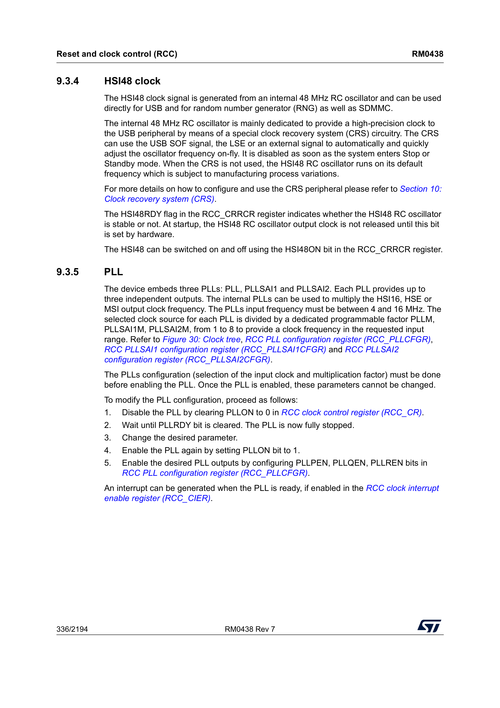
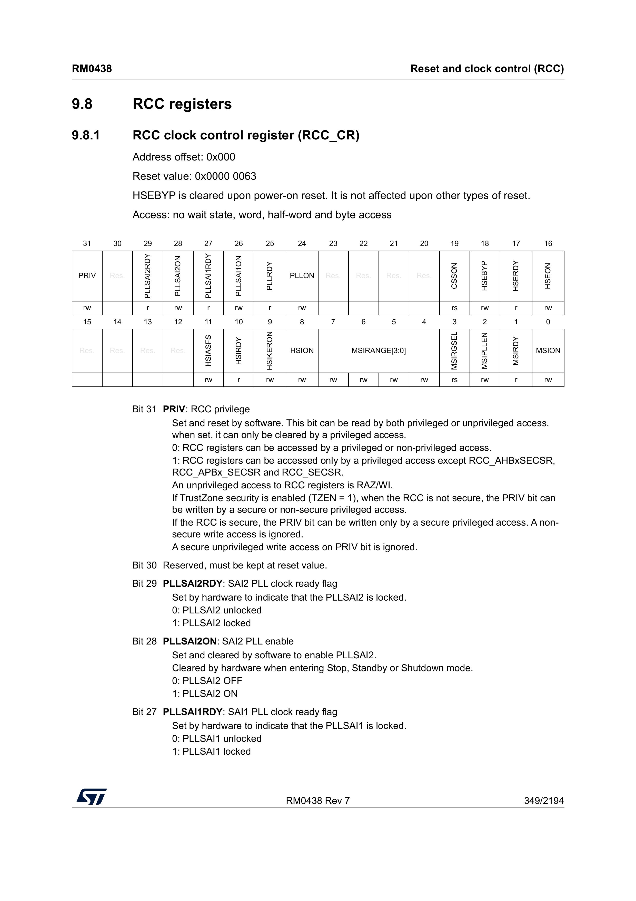
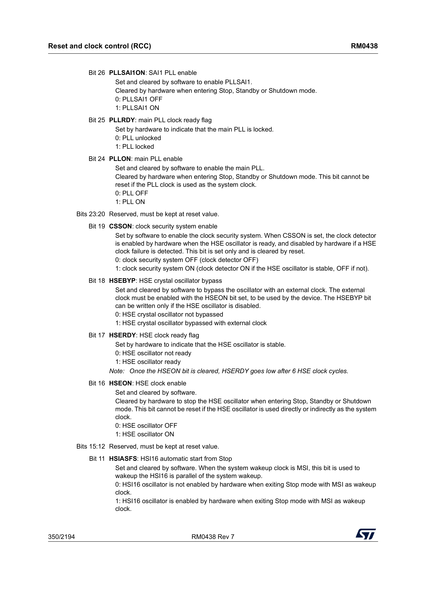
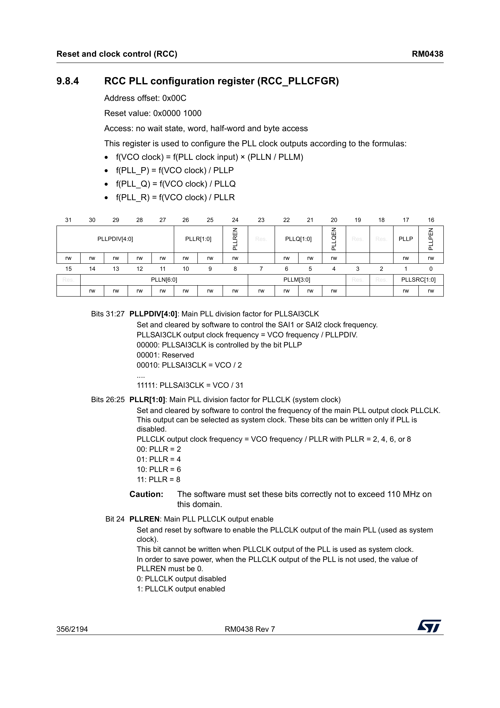
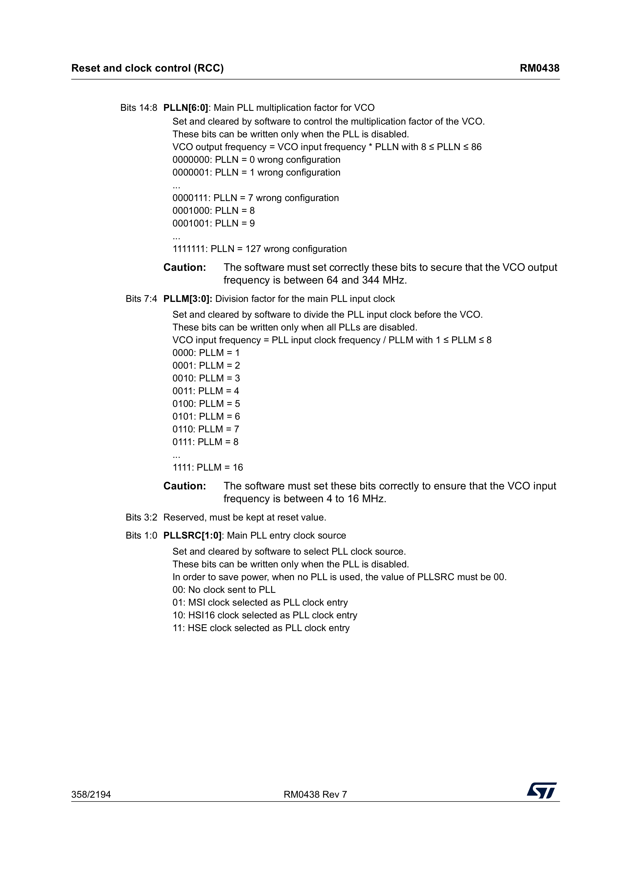
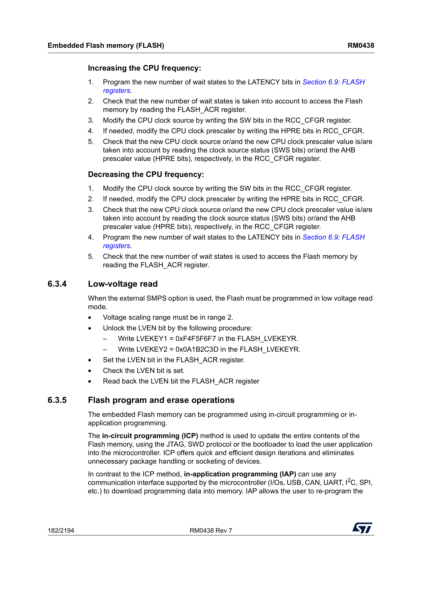
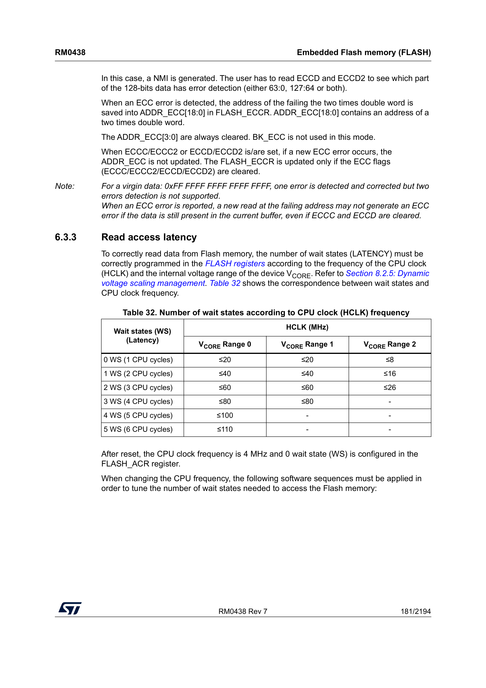
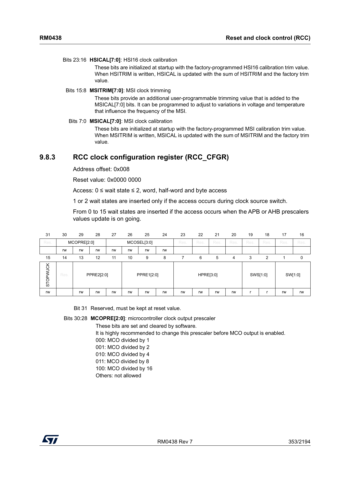
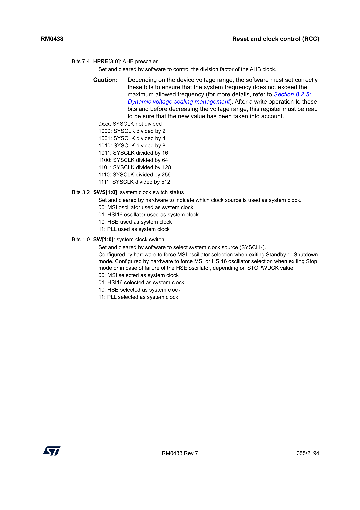

## Introduction

In this post we will program the board's PLL peripheral to output a `110` MHz clock, which we will then use as the system clock. This, naturally, makes our board execute code faster.

Before reading this content, I suggest you read [the first entry in this series of blog posts](https://www.krook.dev/posts/nucleo/1/post.html).

### PLL

After reset, the STM32L552ZEQ is clocked by a 4 MHz internal oscillator. By engaging the PLL we can get access to a clock of 110 MHz. After conferring with my mentor in this space ([my PhD co-advisor Joel](https://svenssonjoel.github.io/index.html)) my understanding is that
- Making an oscillator with a low, stable frequency: _easy_
- Making an oscillator with a high, stable frequency: _hard_

What the PLL does in this case is to run a separate fast oscillator and use feedback to lock the fast oscillator to a multiple of the slow and steady crystal. I won't go into the details of how it actually works, but I hope that this short explanation is enough to give some intuition. Once the PLL peripheral on our board has been configured, it is producing three different clocks. We can configure the board to use one of these as the system clock.

Figuring out how to do this wasn't trivial, but in the end I landed on something that worked. The reference manual has quite a clear step-by-step guide for how the PLL should be configured



All but one of the steps are quite straightforward. The third step is where we need to be clever.

#### Step 1 & 2 - Disabling the PLL and waiting for it to stop

This is done with very few lines of code. The `RCC` peripheral is responsible for turning the PLL off. The step-by-step guide above tells us which register is responsible for this, `RCC->CR`.



Looking at the relevant bits, we find the descriptions



The descriptions say that `PLLON` is set by software (us), whereas `PLLRDY` is set by hardware (the board). We should set the `PLLON` bit to turn on the PLL, and then wait until the board sets the `PLLRDY` bit, so that we know the PLL has engaged properly.

We write this code to implement step 1 and 2.

```c
if (RCC->CR & RCC_CR_PLLON) {
    RCC->CR &= ~RCC_CR_PLLON;
    while (RCC->CR & RCC_CR_PLLRDY);
}
```

#### Step 3 - Configuring the PLL

Before we begin configuring the PLL, we reiterate that we want to configure our board to run at 110 MHz rather than the 4 MHz it is running at after reset. The board has three PLL peripherals, and we want to configure the one simply called PLL. The other two are PLLSAI1 and PLLSAI2, and I believe they are for audio-related applications, but I have not bothered using them.
The PLL configuration register that we want to modify is found in the `RCC` peripheral, `RCC_PLLCFGR`.



There are some formulas here, and we will try to break them down. `f` is not some magic function, and rather just means "frequency of". The `VCO clock` being mentioned is the oscillator running inside the PLL, which we will use feedback to adjust until it is a stable frequency, in relation to the input clock. Spelling out the first formula in words, it says

"The frequency of the internal oscillator equals the frequency of the input clock, multiplied by n divided by m"

The three outputs, `P`, `Q`, and `R`, are then derived by dividing that clock by a factor. We read from the page above that `R` is the output that we can use as the system clock, so we need to pick `N`, `M`, and `R` such that the formula equals 110 MHz.

Our input will be the MSI clock, running at 4 MHz (this is the default configuration after reset). If we pick `N = 55` and `M = 1`, we get

```
f(VCO clock) = f(PLL clock input) * (55 / 1)
f(VCO clock) = 4000000 * 55
f(VCO clock) = 220000000
```

These values for `N` and `M` turn `f(VCO clock)` into a `220` MHz clock, and by picking `PLLR` to be `2`, we get `f(PLL_R)` to be `110` MHz, our desired frequency. The page above shows us that if we write `0` to `PLLR`, we pick `R` to be `2`. For fields `PLLM` and `PLLN`, we refer to two pages down in the reference manual



We see that we must write `55` to `PLLN`, and `0` to `PLLM`. Additionally, we see that the input clock source must get the value `01` in order to use the MSI clock as its input. The reset value is `00`, so this must be changed first.

```c
/* First, we reset every register we intend to configure (writing all 0s to them) */
RCC->PLLCFGR &= ~( RCC_PLLCFGR_PLLSRC
                 | RCC_PLLCFGR_PLLM
                 | RCC_PLLCFGR_PLLN
                 | RCC_PLLCFGR_PLLR);

/* Then, we write out configuration */
RCC->PLLCFGR |= RCC_PLLCFGR_PLLSRC_0
              | (0  << RCC_PLLCFGR_PLLM_Pos)
              | (55 << RCC_PLLCFGR_PLLN_Pos)
              | (0  << RCC_PLLCFGR_PLLR_Pos);
```

This configuration will set the input clock to the `4` MHz MSI clock, and pick our desired values for `N`, `M`, and `R`, to produce an output clock of `110` MHz. We have not yet enabled the output clock, and we cannot do so until we do some additional configuration.

#### Step 4 - Enabling the PLL

The fourth step is simply to turn the PLL back on.

```c
RCC->CR |= RCC_CR_PLLON;
```

While omitted from the step-by-step list, it is good to wait for the PLL to properly start before proceeding. It is not a requirement, however. We wait for the `PLLRDY` bit to be _set_, rather than cleared.

```c
while (!(RCC->CR & RCC_CR_PLLRDY));
```

#### Step 5 - Enabling the desired output

The fifth and final step is to enable the specific output(s) we want the PLL to produce. We only care about the `R` output, so we only enable `PLLREN`.

```c
RCC->PLLCFGR |= RCC_PLLCFGR_PLLREN;
```

The PLL is now fully configured, running, and producing a `110` MHz clock on its `R` output. The only thing left to do is to use the PLL as the system clock.

### Changing the system clock

Page 182 gives us instructions for how to increase and decrease the system clock. Most notably, before we can tell the board to use the PLL clock, we must change the _flash wait states_.



#### Changing flash wait states

This was a gotcha for me, but made sense once I figured it out. When we go from the default `4` MHz system clock to a `110` MHz one, the board is fetching and executing instructions from FLASH more than 27.5 times faster than before. The FLASH cannot deliver them fast enough, so without adding an artificial delay, the board will throw an error. This configuration is called _flash wait states_, and it has to happen *before* we switch the system clock over below, or the CPU starts missing instruction fetches the moment the switch takes effect. On page 181 of the reference manual, we find this table.



If we set the system clock to `110` MHz, we must configure five flash wait states.

```c
/* Set the number of wait states */
FLASH->ACR = (FLASH->ACR & ~FLASH_ACR_LATENCY) | (5 << FLASH_ACR_LATENCY_Pos);

/* Wait for the change to go into effect */
while ((FLASH->ACR & FLASH_ACR_LATENCY) != (5 << FLASH_ACR_LATENCY_Pos));
```

#### Selecting the system clock

With the PLL running and flash configured for the higher frequency, we can finally select the PLL as the system clock. This is, again, not part of the PLL step-by-step guide — it's a separate procedure, found by consulting the `RCC_CFGR` register.



By programming the `SW` bits we can say which clock should be used as the system clock, while the hardware sets the `SWS` bits to say what clock is _currently being used_ as the system clock.



This page tells us that `00` means that it is using the MSI clock, whereas `11` means that we're using the PLL clock. We do the necessary adjustments, and then wait for `SWS` to indicate that the `PLL` is being used.

```c
RCC->CFGR = (RCC->CFGR & ~RCC_CFGR_SW) | (3U << RCC_CFGR_SW_Pos);
while ((RCC->CFGR & RCC_CFGR_SWS) != RCC_CFGR_SWS);
```

Once our program proceeds past this line, the PLL is properly configured and our board is running at 110 MHz. Amazing! Putting it all together as one procedure, we get

```c
void pll_configure_110mhz(void) {
    /* Step 1 & 2 - Disable the PLL and wait for it to stop */
    if (RCC->CR & RCC_CR_PLLON) {
        RCC->CR &= ~RCC_CR_PLLON;
        while (RCC->CR & RCC_CR_PLLRDY);
    }

    /* Step 3 - Configure the PLL */
    RCC->PLLCFGR &= ~( RCC_PLLCFGR_PLLSRC
                     | RCC_PLLCFGR_PLLM
                     | RCC_PLLCFGR_PLLN
                     | RCC_PLLCFGR_PLLR);

    RCC->PLLCFGR |= RCC_PLLCFGR_PLLSRC_0
                  | (0  << RCC_PLLCFGR_PLLM_Pos)
                  | (55 << RCC_PLLCFGR_PLLN_Pos)
                  | (0  << RCC_PLLCFGR_PLLR_Pos);

    /* Step 4 - Enable the PLL */
    RCC->CR |= RCC_CR_PLLON;
    while (!(RCC->CR & RCC_CR_PLLRDY));

    /* Step 5 - Enable the desired output */
    RCC->PLLCFGR |= RCC_PLLCFGR_PLLREN;

    /* Set the number of flash wait states before switching the system clock */
    FLASH->ACR = (FLASH->ACR & ~FLASH_ACR_LATENCY) | (5 << FLASH_ACR_LATENCY_Pos);
    while ((FLASH->ACR & FLASH_ACR_LATENCY) != (5 << FLASH_ACR_LATENCY_Pos));

    /* Select the PLL as the system clock */
    RCC->CFGR = (RCC->CFGR & ~RCC_CFGR_SW) | (3U << RCC_CFGR_SW_Pos);
    while ((RCC->CFGR & RCC_CFGR_SWS) != RCC_CFGR_SWS);
}
```

### Updating our application

The application from the previous blog post configured the systick handler and the UART, both with the assumption that the board was running at 4 MHz. When we now configure the board to run at 110 MHz, we need to account for this change. Below is the complete updated application

```c
void main(void) {
    pll_configure_110mhz();
    SysTick_Config(110000);
    configure_lpuart1(110000000, 115200);
    __enable_irq();

    enable_gpioa();
    configure_gpioa();

    while(1) {
        uart_puts("toggling the LED\r\n");
        toggle_led();
        systick_delay_ms(500);
    }
}
```

This program should blink the LED exactly as before, and output text over the UART unchanged. If you did not change the `SysTick_Config` and `configure_lpuart1` parameters, the LED would blink much faster (since the 4000 ticks are exhausted much faster), and the UART would output garbage.

### Final Remarks

The [code for this post can be found on my GitHub](https://github.com/Rewbert/bare-metal-stm32-nucleo/tree/main/2).

Part 3 is yet to be written, but will be linked here when it is available.